# ue人群制作

## 具有控制头部朝向的人群

### 创建post

#### 创建多个post帧

需要创建多个静止姿势为瞄准偏移做准备  
首先选中导入的fbx动画序列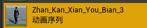,_由于改动后需要保存, 可也先复制出一个_,
使用右键打开菜单后选中**在新窗口中打开**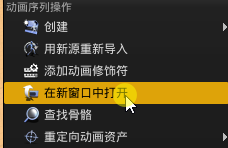,
将游标移动到序列中想要的post帧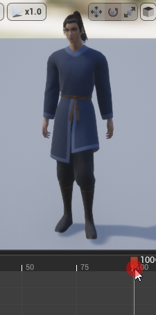,
在**游标上**右键打开动作菜单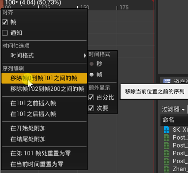,选中**序列编辑**中的第一项,一般是**
移除0到xx之间的帧**
移除后继续在**游标上**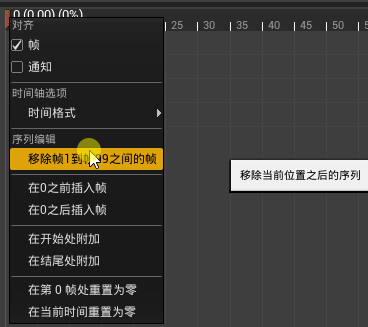选中**序列编辑**中的第一项,一般是**移除0到xx之间的帧**,
之后这个序列会成为**只有一帧的post序列**,在修改完成后需要**保存**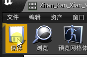,
在需要的post序列中重复这这个过程, 直到创建出了足够的post,
这是创建后的效果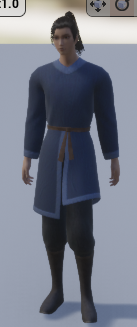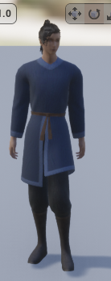
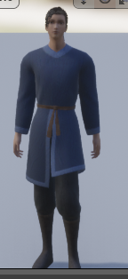

#### 调整post属性

选中创建的post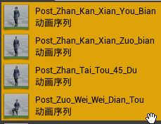,右键弹出菜单动作,在**资产操作**菜单中,
点击**通过属性矩阵进行批量编辑**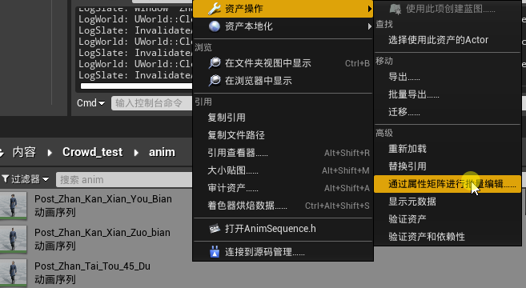,
打开**属性矩阵编辑对话框**, 在属性编辑右侧中打开**additivesetting**子菜单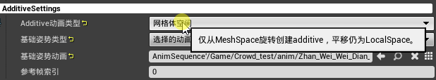,
调整前三个属性值,

- 第一个改为网格体空间
- 第二个更改为选择的动画帧
  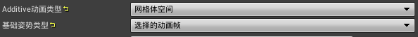
- 第三个更改为**静止post**, 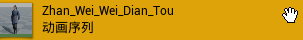,
  这个值必须时和post相同骨骼,

### 创建瞄准偏移

选中导入时网格体的骨骼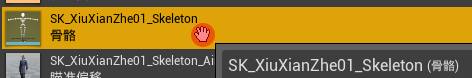,
并右键弹出操作菜单后打开**创建子菜单**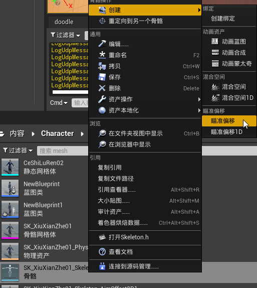,选中**瞄准偏移**,
将创建的**瞄准偏移**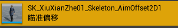双击打开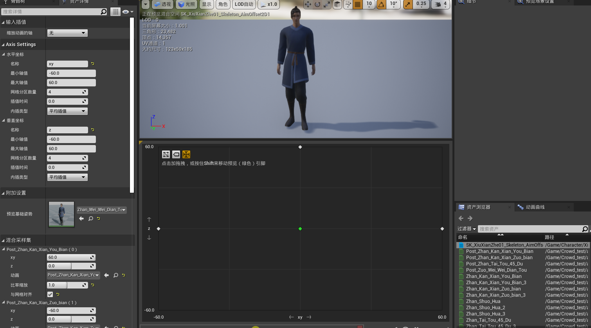,
将右侧的资产编辑器中创建的post拖入做标轴视图中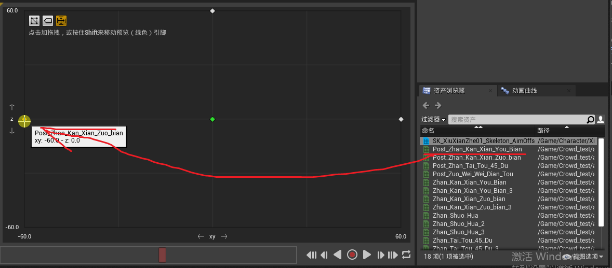,依次拖入所有的post,
在轴视图中的不同位置代表了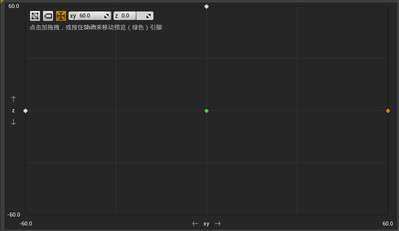,代表了不同参数的混合, 可也拖动绿色的按钮进行预览,
在**轴设置**(**Axis Setting**)窗口中, 设置轴名称为**xy**和**z**名称,并将最大值和最小值重新设置为 60 和 -60,
这个值可也以调整,但是必须保证**绝对值相等**, 并且**绝对值不可大于180**

### 创建动画蓝图

在资源管理器中右键弹出操作菜单, 打开动画子菜单,并且选中**动画蓝图**进行创建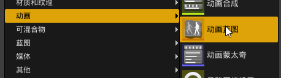,
在弹出菜单中父类选中插件中的 **DoodleAnimInstance**类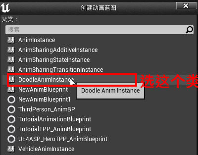,
目标骨骼选中创建post动画引用的骨骼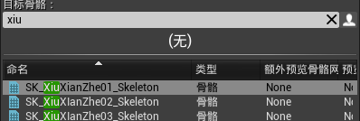,
双击打开刚刚创建的动画蓝图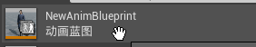,
选中动画图表并进行编辑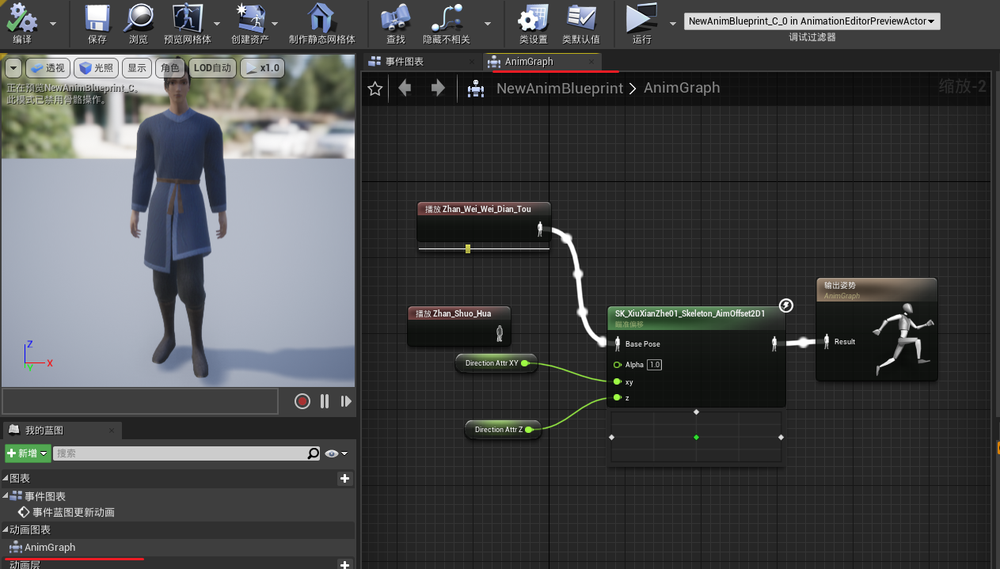,
在窗口中打开**资产游览器**
将**资产游览器**中刚刚创建的瞄准偏移拖入**动画图表**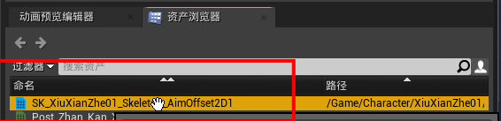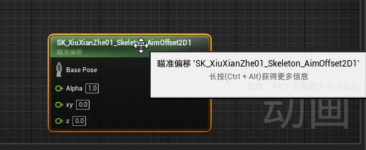,
并将**静止post**从**资产游览器**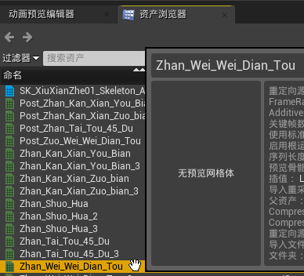拖入**动画图表**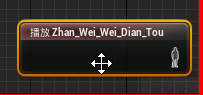,
将**静止post**中的输出链接到瞄准偏移的**base post**输入端,,
在**动画图表**中右键点击弹出**创建操作菜单**,输入**direction**,
搜索变量**获取Direction Attr XY**,**获取Direction Attr Z**条目,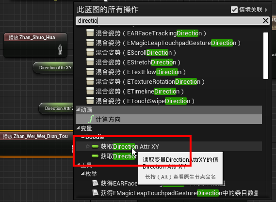
并点击后创建出这个两个条目,并将输出从 **获取Direction Attr XY** 连接到
**xy**输入端, 输出从 **获取Direction Attr Z** 连接到 **z**输入端,
最终将瞄准偏移的输出连接到**输出姿势**的输入端,
并点击**编译**和**保存**完成创建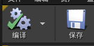

### 创建pawn类

### 在导演蓝图中创建委托
